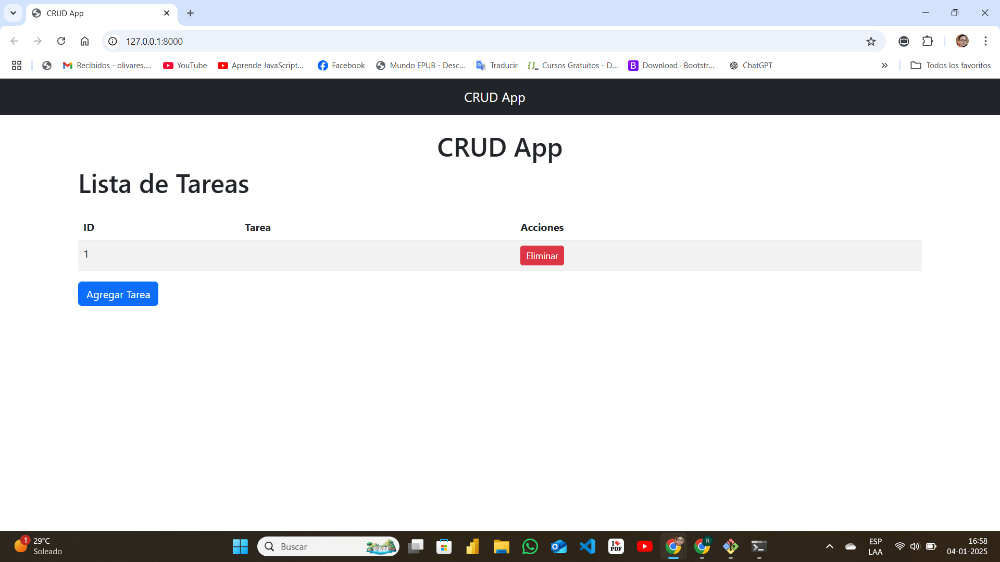
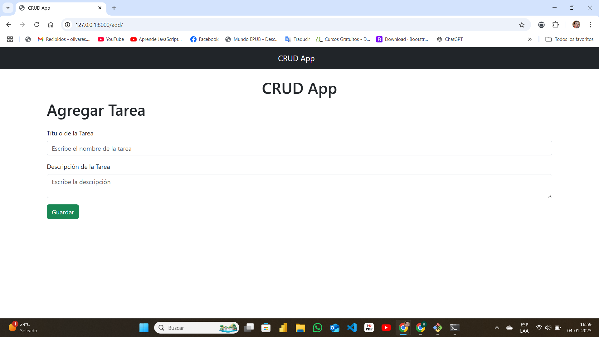
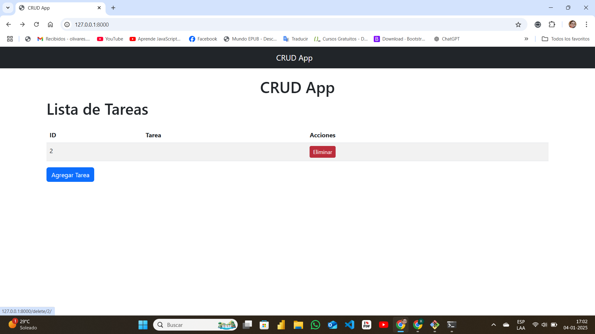
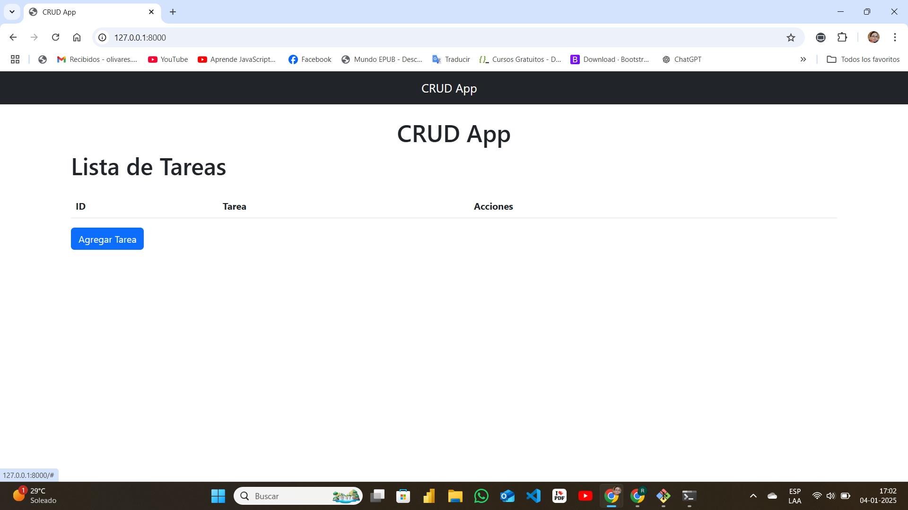
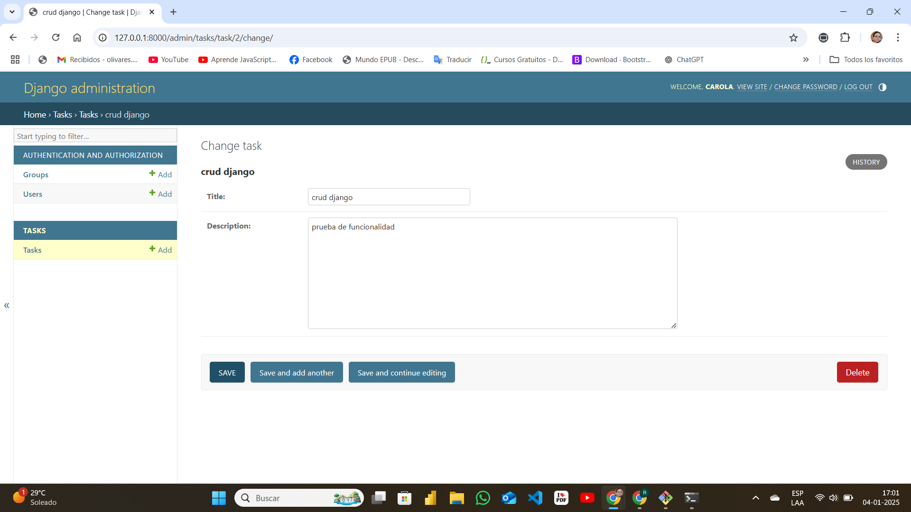

# Proyecto-Crud

# Proyecto CRUD con Django

Este proyecto es una aplicación web CRUD (Crear, Leer, Actualizar y Eliminar) desarrollada con el framework Django. El objetivo es gestionar tareas, permitiendo a los usuarios agregar, visualizar, editar y eliminar registros.

## Características principales

- **Gestor de tareas**: Los usuarios pueden agregar tareas con título y descripción, visualizarlas en una lista, editarlas o eliminarlas.
- **Bootstrap integrado**: La interfaz está diseñada con Bootstrap para una apariencia responsiva.
- **Organización del código**: Uso de vistas basadas en funciones y un sistema de templates.

## Tecnologías utilizadas

- **Lenguaje de programación**: Python 3.11
- **Framework web**: Django 5.1.4
- **Base de datos**: SQLite (por defecto en Django)
- **Frontend**: HTML, CSS y Bootstrap
- **Control de versiones**: Git y GitHub

## Estructura del proyecto

Proyecto-Crud/
|— crud_django/
    |— tasks/
        |— migrations/
        |— templates/
        |— static/
        |— admin.py
        |— apps.py
        |— models.py
        |— views.py
        |— urls.py
    |— crud_django/
        |— settings.py
        |— urls.py
        |— wsgi.py
    |— manage.py
|— README.md
|— .gitignore

## Configuración del entorno local

Sigue estos pasos para ejecutar el proyecto en tu máquina local:

1. Clona el repositorio:
   ```bash
   git clone <URL_DEL_REPOSITORIO>
   cd Proyecto-Crud
   ```

2. Crea un entorno virtual y actívalo:
   ```bash
   python -m venv venv
   source venv/bin/activate   # En Windows: venv\Scripts\activate
   ```

3. Instala las dependencias:
   ```bash
   pip install -r requirements.txt
   ```

4. Realiza las migraciones de la base de datos:
   ```bash
   python manage.py makemigrations
   python manage.py migrate
   ```

5. Ejecuta el servidor local:
   ```bash
   python manage.py runserver
   ```

6. Accede a la aplicación en tu navegador:
   ```
   http://127.0.0.1:8000
   ```

## Capturas de pantalla
### Página principal

### Agregar una tarea

### Tarea agregada

### Eliminar una tarea

### Administrador de Django


## Contribución

Si deseas contribuir a este proyecto:

1. Haz un fork del repositorio.
2. Crea una rama para tu función o corrección:
   ```bash
   git checkout -b nombre-de-tu-rama
   ```
3. Realiza tus cambios y haz un commit:
   ```bash
   git commit -m "Descripción de los cambios"
   ```
4. Envía un pull request.

## Licencia

Este proyecto está bajo la Licencia MIT. Consulta el archivo `LICENSE` para más información.

